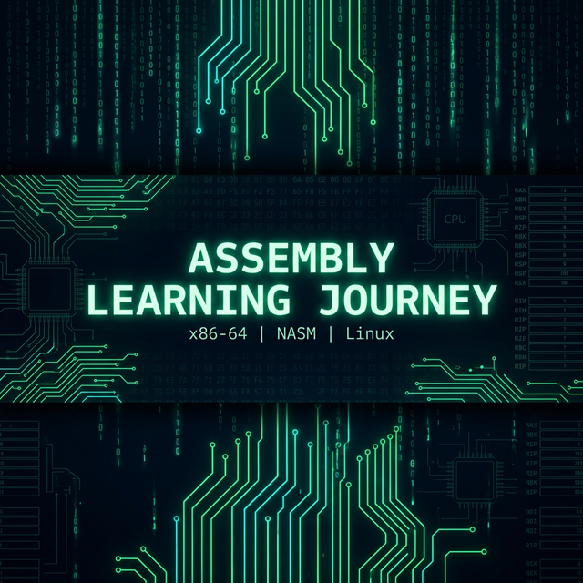

<div align="center">



# 🖥️ Assembly Learning Journey

**x86-64 Assembly dilini sıfırdan öğrenmek için yapılandırılmış, pratik bir yolculuk.**

[](LICENSE)
[](https://github.com/bahattinyunus/Assembly-Learning-Journey/actions)


[](CONTRIBUTING.md)

</div>

---

## � Bu Repo Hakkında

Bu repo, x86-64 Assembly dilini sıfırdan öğrenme yolculuğumu belgeler. Her bölüm, teorik açıklamalar ve çalışan kod örnekleri içerir. Amaç: "low-level" programlamayı gerçekten anlamak — CPU'nun nasıl çalıştığını, hafızanın nasıl yönetildiğini ve işletim sisteminin Assembly koduyla nasıl etkileşime girdiğini kavramak.

> **"Assembly öğrenmek, bilgisayarın dilini konuşmayı öğrenmek gibidir."**

---

## 🗺️ Yol Haritası & İçerik

| # | Bölüm | Konu | Dosyalar | Durum |
|---|-------|------|----------|-------|
| 00 | [Temel Kavramlar](./00_Basics/) | Register'lar, Syntax, Hello World | `hello_world`, `registers` | ✅ |
| 01 | [Veri Tipleri](./01_Data_Types/) | DB/DW/DD/DQ, String, Integer | `integers`, `strings` | ✅ |
| 02 | [Kontrol Akışı](./02_Control_Flow/) | CMP, Flags, Jump, Döngüler | `conditionals`, `loops` | ✅ |
| 03 | [Prosedürler](./03_Procedures/) | ABI, Stack Frame, Rekürsif | `functions`, `stack` | ✅ |
| 04 | [Bellek Yönetimi](./04_Memory/) | Adresleme Modları, LEA | `memory_addressing` | ✅ |
| 05 | [Sistem Çağrıları](./05_System_Calls/) | Linux Syscall ABI, I/O, Error | `linux_syscalls` | ✅ |
| 06 | [Optimizasyon](./06_Optimization/) | Loop Unroll, Branchless, CMOV | `loop_unrolling`, `branch_opt` | ✅ |
| 07 | [Projeler](./07_Projects/) | Hesap Makinesi, String Lib, Printer | `calculator`, `string_utils`, `number_printer` | ✅ |
| 08 | [FPU & SIMD](./08_FPU_SIMD/) | SSE2, AVX, Float/Double, Packed | `fpu_basics` | ✅ |

---

## ⚙️ Gereksinimler & Kurulum

### Linux (Ubuntu/Debian)
```bash
# NASM assembler'ı kur
sudo apt update && sudo apt install nasm build-essential

# Bir programı derle ve çalıştır
nasm -f elf64 hello_world.asm -o hello_world.o
ld hello_world.o -o hello_world
./hello_world
```

### Windows (WSL2 veya MinGW)
```bash
# WSL2 üzerinde Linux komutlarını kullan
# ya da NASM'ı Windows'a kur: https://www.nasm.us/

# Windows için (PE format ile)
nasm -f win64 program.asm -o program.obj
link program.obj /subsystem:console /entry:_start
```

---

## � Bölümler

### [00 - Temel Kavramlar](./00_Basics/)
- CPU register'ları (RAX, RBX, RCX, RDX, RSI, RDI, RSP, RBP)
- NASM syntax'ı (Intel syntax)
- İlk "Hello, World!" programı
- Mov, add, sub gibi temel instruction'lar

### [01 - Veri Tipleri](./01_Data_Types/)
- `DB`, `DW`, `DD`, `DQ` direktifleri
- String tanımı ve manipülasyonu
- İşaretli/işaretsiz integer'lar
- `.data` ve `.bss` section'ları

### [02 - Kontrol Akışı](./02_Control_Flow/)
- `CMP` ve `TEST` instruction'ları
- Koşullu atlamalar: `JE`, `JNE`, `JG`, `JL`, `JGE`, `JLE`
- `JMP` ile basit döngüler
- `LOOP` instruction'ı

### [03 - Prosedürler](./03_Procedures/)
- `CALL` ve `RET` instruction'ları
- Stack frame oluşturma (`PUSH RBP`, `MOV RBP, RSP`)
- System V AMD64 ABI (Linux calling convention)
- Lokal değişkenler ve parametre geçişi

### [04 - Bellek Yönetimi](./04_Memory/)
- Adresleme modları: immediate, register, memory, scaled index
- `LEA` instruction'ı
- Stack belleği vs heap belleği
- `brk`/`mmap` syscall ile dinamik bellek

### [05 - Sistem Çağrıları](./05_System_Calls/)
- Linux syscall tablosu (x86-64)
- `SYSCALL` instruction'ı
- Dosya okuma/yazma, process yönetimi
- Exit codes

---

## 🔑 Hızlı Referans

### x86-64 General Purpose Registers
```
64-bit  32-bit  16-bit  8-bit   Kullanım
RAX     EAX     AX      AL      Accumulator / Return value
RBX     EBX     BX      BL      Base (callee-saved)
RCX     ECX     CX      CL      Counter / 4. parametre
RDX     EDX     DX      DL      Data / 3. parametre
RSI     ESI     SI      SIL     Source / 2. parametre
RDI     EDI     DI      DIL     Destination / 1. parametre
RSP     ESP     SP      SPL     Stack Pointer
RBP     EBP     BP      BPL     Base Pointer
R8-R15  ...     ...     ...     Ek register'lar
```

### Linux x86-64 Önemli Syscall'lar
```
Syscall  Numara  Açıklama
read     0       Dosyadan/stdin'den oku
write    1       Dosyaya/stdout'a yaz
open     2       Dosya aç
close    3       Dosya kapat
exit     60      Process'i sonlandır
```

---

## � Repo Yapısı

```
Assembly-Learning-Journey/
├── 00_Basics/
│   ├── hello_world.asm     # İlk Assembly programı
│   ├── registers.asm       # Register kullanım örnekleri
│   └── README.md
├── 01_Data_Types/
│   ├── integers.asm        # Integer veri tipleri
│   ├── strings.asm         # String tanımı ve kullanımı
│   └── README.md
├── 02_Control_Flow/
│   ├── conditionals.asm    # if/else karşılığı
│   ├── loops.asm           # Döngü örnekleri
│   └── README.md
├── 03_Procedures/
│   ├── functions.asm       # Fonksiyon tanımı ve çağrısı
│   ├── stack.asm           # Stack frame yönetimi
│   └── README.md
├── 04_Memory/
│   ├── memory_addressing.asm  # Adresleme modları
│   └── README.md
├── 05_System_Calls/
│   ├── linux_syscalls.asm  # Linux syscall örnekleri
│   └── README.md
├── resources/
│   └── cheatsheet.md       # Hızlı referans kağıdı
└── README.md
```

---

## 🐛 Debug İpuçları

```bash
# GDB ile debug et
gdb ./program
(gdb) layout asm          # Assembly görünümü
(gdb) break _start        # Başlangıçta breakpoint
(gdb) run
(gdb) info registers      # Register değerlerini göster
(gdb) stepi               # Tek instruction ilerle
(gdb) x/10xb $rsp         # Stack'i hex olarak göster

# strace ile syscall'ları izle
strace ./program
```

---

## � Önerilen Kaynaklar

- 📕 **[Intel Software Developer Manuals](https://www.intel.com/content/www/us/en/developer/articles/technical/intel-sdm.html)** - Resmi referans
- 📗 **[NASM Documentation](https://www.nasm.us/doc/)** - NASM resmi dökümantasyonu
- 📘 **[x86-64 ABI](https://refspecs.linuxbase.org/elf/x86_64-abi-0.99.pdf)** - Linux calling convention PDF
- 🌐 **[OSDev Wiki](https://wiki.osdev.org/)** - Low-level programlama wiki'si
- 🌐 **[Godbolt Compiler Explorer](https://godbolt.org/)** - C kodunun Assembly çıktısını gör
- 📺 **[Low Level Learning (YouTube)](https://www.youtube.com/@LowLevelLearning)** - Harika video serileri
- 🌐 **[Felix Cloutier x86 Reference](https://www.felixcloutier.com/x86/)** - Tüm instruction'ların açıklaması

---

## 🤝 Katkı

Bu bir öğrenme reposudur. Hata veya iyileştirme önerilerin varsa:
1. Bir [Issue](../../issues) aç
2. Fork yap ve Pull Request gönder

---

<div align="center">

**⭐ Beğendiysen yıldız atmayı unutma!**

Made with ❤️ and lots of `MOV` instructions

</div>
